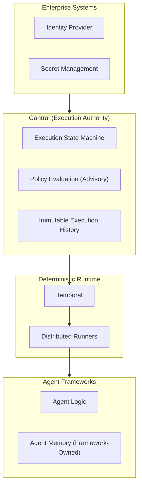

# Gantral

> **AI Execution Control Plane (Open Source)**


**Gantral** is an open-source project defining a neutral **execution authority layer** for AI-assisted and agentic systems.

Gantral provides infrastructure primitives to **govern, pause, resume, and audit execution-time decisions** — independent of agent frameworks, models, or workflow engines.

Gantral does not build agents or workflows.  
It defines **when execution may proceed** and **how that decision is recorded**.

---


### Running Tests

- **Tier 1 (Fast, Deterministic)**: `make test-tier1`
- **Tier 2 (Integration)**: `make test-tier2`
- **All Tests**: `make test`

---

## Why Gantral Exists


As AI systems are embedded into real operational workflows, organizations encounter execution-time governance failures that existing tools do not address.

In practice:

- approval rules drift into agent code, scripts, and prompts
- similar workflows enforce governance differently across teams
- policy changes require code changes in multiple places
- human approvals are enforced socially rather than technically
- audits reconstruct decisions after the fact rather than replaying them

Gantral exists to make **execution authority explicit, enforceable, and replayable**.

---

## What Gantral Is — and Is Not

Gantral **is**:

- an execution authority layer
- a deterministic control plane for AI-assisted actions
- a system of record for execution-time decisions
- infrastructure for explicit Human-in-the-Loop (HITL) enforcement

Gantral **is not**:

- an agent framework
- a workflow engine or orchestrator
- a policy authoring system
- an AI governance UI
- an autonomous or self-approving system

Gantral sits **above agents and automation** and **below organizational accountability**.

---

## Where Gantral Fits

Gantral introduces a clear responsibility boundary:

- **Agents** reason, plan, and act
- **Gantral** determines whether execution may proceed
- **Humans** retain final authority
- **Audit systems** consume deterministic execution records

Gantral uses a **federated execution model**:  
agent code runs on team-owned infrastructure, while Gantral manages execution state and authority decisions.



---

## Core Capabilities

### Execution Authority and HITL

Human-in-the-Loop is modeled as an **execution state**, not a notification or convention.
Execution pauses explicitly and resumes only after a recorded decision.

### Deterministic Execution and Replay

Execution decisions are instance-scoped, append-only, and replayable without relying on agent memory or transient logs.

### Federated Execution

Agents run on team-owned infrastructure.
Gantral does not execute agent logic or handle sensitive payloads.

### Policy as Transition Guard

External policy engines provide **advisory signals** that act as transition guards, not decision-makers.

### Long-Running Approvals

Gantral supports long-running approvals via agent-native persistence or split-agent execution patterns, without holding compute resources during waits.

---

## Scope and Boundaries

| Execution authority infrastructure | Agent framework                   |
| Deterministic decision ledger      | Workflow engine                   |
| HITL enforcement layer             | Autonomous system                 |
| Federated and self-hosted          | Identity provider or secret store |
| **Provable admissibility**         | **Black-box logs**                |

These boundaries are intentional and non-negotiable.

---

## Verification & Admissibility

Gantral produces cryptographically verifiable **Commitment Artifacts** that serve as independent evidence of execution authority.

### Principles
*   **Immutable:** Artifacts cannot be modified after emission.
*   **Log-Independent:** Verification does not require access to Gantral logs or databases.
*   **Offline Verifiable:** Auditors can verify chains of custody on an air-gapped machine.

### Offline Verification Tool
We provide a standalone CLI tool for auditors:

```bash
# Verify a single artifact file
go run cmd/gantral-verify/main.go file /path/to/artifact.json

# Verify an entire chain of evidence
go run cmd/gantral-verify/main.go chain /path/to/artifact_dir/
```

---

## Documentation

📘 **[Full Documentation](docs/README.md)**

Key references:

* **[Technical Reference (TRD)](docs/architecture/trd.md)**
  Authoritative architecture, invariants, and execution semantics.

* **[Execution State Machine](docs/architecture/state-machine.md)**
  Canonical lifecycle and guarantees.

* **[Implementation Guide](docs/architecture/implementation-guide.md)**
  Reference guidance aligned with the TRD.

* **[Consumer Integration Guide](docs/guides/example-consumer-integration.md)**
  Normative guidance for integrating agents and systems.

* **[Product Specification (PRD)](docs/product/prd.md)**
  Product boundaries and intent.

* **[Adoption Guides](docs/adoption/README.md)**
  How organizations evaluate and introduce Gantral safely.

---

## Getting Started (Reference Demos)

The repository includes reference examples demonstrating execution pauses, approvals, and deterministic resumption.

To run the persistent-agent demo:

```bash
cd examples/persistent-agent
docker compose up --build
```

Then trigger and approve an execution using the provided scripts.

These examples are illustrative and not required for production use.

---

## Project Status

Gantral is an active open-source project under development.

The current focus is on:

* execution correctness
* authority semantics
* deterministic replay
* integration clarity

Roadmap details are available in the documentation.

---

## Governance and Community

Gantral is a maintainer-led open-source project developed in the open.

* **[Governance](GOVERNANCE.md)** – decision-making and project structure
* **[Contributing](CONTRIBUTING.md)** – contribution guidelines
* **[Code of Conduct](CODE_OF_CONDUCT.md)** – community standards
* **[Security](SECURITY.md)** – vulnerability reporting

Gantral is an independent project and is **not affiliated with the Cloud Native Computing Foundation (CNCF)**.
Design choices are informed by CNCF principles, including neutrality, composability, and clear responsibility boundaries.

---

© 2025 Rainminds. Licensed under the Apache License, Version 2.0.