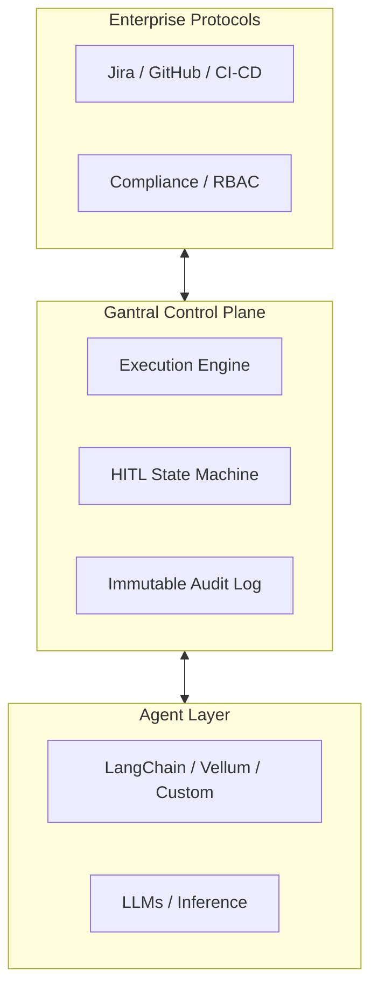

# Gantral

> **The AI Execution Control Plane**

  

**Gantral** is the open-source standard for governing AI agents in the enterprise.

Just as Kubernetes manages container orchestration, **Gantral manages AI execution semantics**—standardizing how agents execute, pause for human authority, escalate risk, and prove accountability.

It solves the "Who authorized this?" problem by providing a deterministic execution engine, immutable audit logs, and a first-class Human-in-the-Loop (HITL) state machine.

---

## 🧩 Where Gantral Fits

Gantral sits **above** agent frameworks (LangChain, CrewAI, Vellum) and **below** enterprise compliance systems. It does not build agents; it governs them.



---

## 🚀 Capabilities

### 1. Instance-First Execution Model
Every policy, approval, cost, and audit trail attaches to a **specific execution instance**—not a generic agent. This guarantees isolation, replayability, and accountability across teams.

### 2. Deterministic State Machine
HITL is a first-class state transition. Agents don't just "stop" or "fail"; they enter a `WAITING_FOR_HUMAN` state that is auditable, secure, and resumable.

### 3. Policy-as-Code
Define materiality and authority rules (e.g., *"Always require approval for prod DB writes"* or *"Escalate transactions > $50"*) using declarative YAML/JSON.

### 4. Regulatory Compliance
Designed to satisfy **EU AI Act (Art. 14)** human oversight requirements and **SOC 2 Type II** auditability standards out of the box.

---

## ❗ Scope

| Gantral IS | Gantral IS NOT |
| :--- | :--- |
| ✅ An AI execution control plane | ❌ An agent builder or LLM host |
| ✅ A system of record for decisions | ❌ An autonomous "magic" platform |
| ✅ Infrastructure for HITL & Audit | ❌ A replacement for Jira/CI-CD |
| ✅ Vendor-neutral & Framework-agnostic | ❌ A tool to bypass human authority |

---

## 📚 Documentation

The technical constitution of Gantral lives in the `specs/` directory. These documents are the **Single Source of Truth**.

- **[Technical Specifications](specs/README.md)**: The complete technical reference.
- **[Architecture](specs/01-architecture.md)**: Scope, invariants, and layers.
- **[Domain Model](specs/02-domain-model.md)**: Workflows, Instances, and Decisions.
- **[State Machine](specs/03-state-machine.md)**: The canonical lifecycle (Created → Running → Waiting).
- **[Security](specs/06-security.md)**: Auth, secrets, and zero-trust principles.

## 🛠️ Development

To build the core engine:

```
make build
```

To run tests:

```
make test
```

## 🏛️ Governance & Community

Gantral is a "Maintainer-Led" project committed to transparency and community collaboration.

- **[Governance](GOVERNANCE.md)**: How decisions are made.
- **[Contributing](CONTRIBUTING.md)**: DCO and contribution guidelines.
- **[Code of Conduct](CODE_OF_CONDUCT.md)**: CNCF-aligned community standards.
- **[Security](SECURITY.md)**: Vulnerability reporting.

---

## 📘 Executive Briefings (Optional Context)

For stakeholders evaluating Rainminds, Gantral, and Gantrio from an
enterprise, risk, or regulatory perspective, we maintain a short set of
executive briefings that explain:

- what the system is,
- how work changes after adoption,
- how it scales across teams,
- and why it stands up to regulatory scrutiny.

These materials are **not required** to understand or contribute to the
open-source project, but are useful contexts for enterprise discussions.

- [Gantral & Gantrio — Executive Overview](https://youtu.be/WEbsdmBWkRI)
- [What Changes After Adoption](https://youtu.be/g59alKYgF2Y)
- [The AI Execution Plane](https://youtu.be/Iqsmg5ipRTY)
- [Regulatory & Compliance Outcomes](https://youtu.be/vwPRMOoXW9o)

---

<p align="left">
  © 2025 Rainminds. Licensed under Apache 2.0.
</p>