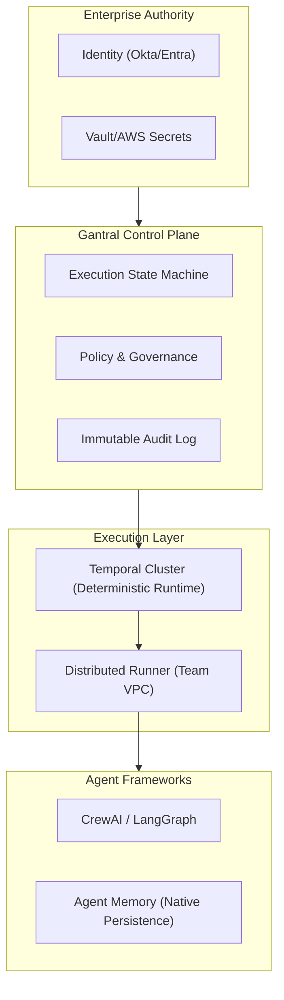

# Gantral

> **The AI Execution Control Plane**

   

**Gantral** is the open-source standard for governing AI agents in the enterprise.

Just as Kubernetes manages container orchestration, **Gantral manages AI execution semantics**—standardizing how agents execute, pause for human authority, escalate risk, and prove accountability.

It solves the "Who authorized this?" problem by providing a deterministic execution engine, immutable audit logs, and a first-class Human-in-the-Loop (HITL) state machine backed by **Temporal**.

---

## 🧩 Where Gantral Fits

Gantral acts as the **Authority Layer** above your agent frameworks (LangChain, CrewAI, AutoGen) and the **Orchestration Layer** below your enterprise infrastructure.

It uses a **Federated Runner Architecture**: Code runs on your team's infrastructure; Gantral manages the decision state.



---

## 🚀 Capabilities

### 1. Federated Execution Model
**Your code, your infra.** Agents execute on distributed **Runners** deployed in your secure VPCs. Sensitive data never leaves your environment; only metadata and decisions flow to the Control Plane.

### 2. First-Class HITL State Machine
Human-in-the-Loop is not a UI feature—it's an execution state.
Agents transition to `WAITING_FOR_HUMAN`, **hibernate** (releasing compute), and resume deterministically only when authorized.

### 3. Agent-Native Persistence
Gantral supports long-running approvals (days/weeks) by leveraging **Agent Framework Checkpointing** (e.g., CrewAI `@persist`, LangGraph Checkpoints). No zombie processes consuming RAM while waiting for approval.

### 4. Policy-as-Guard
Define materiality and authority rules (e.g., *"Always require VP approval for transfers > $10k"*) using declarative Policy-as-Code. Policies act as **Transition Guards**, enforced synchronously before any action occurs.

### 5. Regulatory Compliance
Designed to satisfy **EU AI Act (Art. 14)** human oversight requirements and **SOC 2 Type II** auditability standards. Every decision is cryptographically linked to a human identity and policy version.

---

## ❗ Scope

| Gantral IS | Gantral IS NOT |
| :--- | :--- |
| ✅ An AI execution authority layer | ❌ An agent builder or LLM host |
| ✅ A system of record for decisions | ❌ An autonomous "magic" platform |
| ✅ Infrastructure for HITL & Audit | ❌ A replacement for Jira/CI-CD |
| ✅ Identity & Secret Agnostic (Federated) | ❌ An Identity Provider or Secret Store |

---

## 📚 Documentation

**📘 [Read the Full Documentation](docs/README.md)**

The technical constitution of Gantral lives in the `specs/` directory.

- **[Technical Reference](docs/architecture/trd.md)**: The master architecture document.
- **[Architecture Decisions](specs/adr/)**: Why we chose Temporal, Federated Runners, and OIDC.
- **[Consumer Guide](docs/guides/example-consumer-integration.md)**: How to integrate agents with Gantral.
- **[Execution vs Memory](docs/architecture/execution-authority-vs-agent-memory.md)**: Understanding state ownership.
- **[Product Requirements](docs/product/prd.md)**: The product vision and requirements.


---

## 🚀 Quick Start (Local Dev)

Want to see HITL in action?

1. **Prerequisites**:
   *   Docker & Docker Compose
   *   Go 1.24+

2. **Start the Infrastructure**:
   ```bash
   # Starts Postgres, Temporal Server, and Temporal UI
   make up
   ```

3. **Start the Control Plane**:
   ```bash
   # Terminal 1: Run the API Server
   go run cmd/server/main.go
   ```

4. **Start a Worker (Runner)**:
   ```bash
   # Terminal 2: Run the Execution Worker
   go run cmd/worker/main.go
   ```

5. **Trigger High-Materiality Workflow**:
   ```bash
   curl -X POST http://localhost:8080/instances \
     -H "Content-Type: application/json" \
     -d '{
       "workflow_id": "demo-flow", 
       "policy": {"materiality": "HIGH", "requires_human_approval": true}
     }'
   ```

6. **Approve via UI**: Visit [http://localhost:8080](http://localhost:8080) to see the state `WAITING_FOR_HUMAN`, verify the audit trail, and Approve.

---

## 🛠️ Development & Architecture

Gantral is built on:
*   **Language**: Go 1.24+ (Core), Python/TS (SDKs)
*   **Runtime**: Temporal (Workflow Durability)
*   **Storage**: Postgres 16 (Event Store)
*   **Identity**: OIDC (Federated)

To run the full test suite:
```bash
make test
```

---

## 🏛️ Governance & Community

Gantral is a "Maintainer-Led" project committed to transparency and community collaboration.

- **[Governance](GOVERNANCE.md)**: How decisions are made.
- **[Contributing](CONTRIBUTING.md)**: DCO and contribution guidelines.
- **[Code of Conduct](CODE_OF_CONDUCT.md)**: CNCF-aligned community standards.
- **[Security](SECURITY.md)**: Vulnerability reporting.

---

<p align="left">
  © 2026 Rainminds. Licensed under Apache 2.0.
</p>
