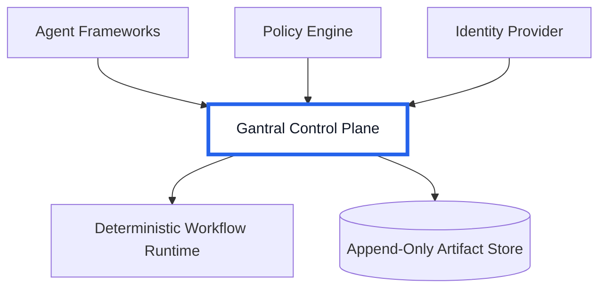

# Gantral

> **Execution Infrastructure for Deterministic Agentic AI**  

> *Unify execution, separate policy from code, and make authority replayable.*


[](https://doi.org/10.5281/zenodo.18682545)

---

## Executive Summary

Gantral is an open-source execution control plane for agentic AI systems.  
It eliminates policy–code duplication, enforces deterministic authority state, and produces replayable chain-of-custody evidence.  
Policy updates no longer require workflow redeployments.  
Authority transitions become cryptographically verifiable.  
Execution decisions become independently inspectable — without logs or runtime access.

---

## Why Enterprises Deploy Gantral

As agentic AI systems enter production, organizations face three structural risks:

### 1. Slow Policy Changes & Redeployment Risk

Approval limits and governance thresholds embedded in workflow code lead to:

- Redeployments for simple policy updates  
- Forked workflows across environments  
- Configuration drift across teams  
- Increased operational overhead  

Gantral separates policy from workflow implementation, enabling policy agility without redeployment.

---

### 2. Inconsistent Governance Across Systems

When policy evaluation, human approval, and execution occur in separate systems:

- Authority is documented but not enforced as state  
- Governance drifts over time  
- Accountability becomes ambiguous  

Gantral binds authority directly to canonical workflow state transitions.

Authority becomes infrastructure — not convention.

---

### 3. Inability to Independently Verify Decisions

In post-incident scenarios, reconstruction often depends on:

- Logs  
- Runtime access  
- Policy memory  
- Human testimony  

Gantral emits cryptographically chained commitment artifacts at authority boundaries.

Execution decisions become replayable and independently verifiable.

---

## What Gantral Enables

Gantral introduces deterministic execution semantics that:

- Enforce authority as canonical workflow state  
- Eliminate policy–code duplication  
- Prevent governance drift  
- Bind workflow and policy versions at decision time  
- Produce tamper-evident authority artifacts  
- Enable offline replay verification  

Gantral does not build agents.  
Gantral does not replace workflow engines.  
Gantral enforces execution-time authority as infrastructure.

---

## Deterministic Authority Model

Gantral defines a canonical authority state machine:

```

CREATED → RUNNING → WAITING_FOR_HUMAN
→ APPROVED / REJECTED / OVERRIDDEN
→ RESUMED → COMPLETED / TERMINATED

````

Authority transitions:

- Are explicitly enumerated  
- Are atomic with artifact emission  
- Cannot occur without durable persistence  
- Are version-bound and identity-bound  

Execution cannot proceed beyond governed boundaries without structural evidence.

---

## Commitment Artifact

At each authority boundary, Gantral emits a structured Commitment Artifact:

```json
{
  "artifact_version": "1.0",
  "artifact_id": "uuid",
  "instance_id": "uuid",
  "workflow_version_id": "string",
  "prev_artifact_hash": "hex",
  "authority_state": "APPROVED | REJECTED | OVERRIDDEN",
  "policy_version_id": "string",
  "context_snapshot_hash": "hex",
  "human_actor_id": "string",
  "justification": "string",
  "timestamp": "RFC3339",
  "artifact_hash": "hex"
}
````

Each artifact:

* Binds workflow version
* Binds policy version
* Binds validated identity
* Binds decision context
* Links recursively to prior artifacts

Artifacts form a tamper-evident chain.

---

## Independent Replay

Replay validation verifies:

1. Artifact chain integrity
2. Valid state transitions
3. Workflow version consistency
4. Policy version consistency

Replay requires:

* No runtime access
* No database access
* No logs
* No agent memory

Authority decisions become independently inspectable.

---

## Architecture

Gantral operates between agent frameworks and deterministic workflow runtime.



Policy advises.
Gantral enforces.
Runtime executes.

---

## Policy Separation (OPA Integration)

Policy is external and versioned independently.

* Authored in Rego
* Evaluated at authority boundaries
* Bound into artifacts via `policy_version_id`

Policy thresholds can change without redeploying workflows.

This increases change velocity while reducing risk.

---

## Storage Model

* PostgreSQL stores non-authoritative indices
* Commitment artifacts are written to append-only object storage
* Artifact store is authoritative for replay
* Write-once configuration prevents modification

Replay depends exclusively on artifact integrity.

---

## Documentation & Papers

📘 **Documentation**
[https://docs.gantral.org/](https://docs.gantral.org/)

📄 **Research & Specification Papers**
[https://gantral.org/papers](https://gantral.org/papers)

Gantral is the open-source reference implementation of the AI Execution Control Plane described in the published specification.

---

## Core Enterprise Outcomes

Gantral enables organizations to:

* Accelerate policy changes without redeployment
* Eliminate workflow forks across environments
* Reduce operational complexity
* Enforce consistent authority semantics
* Prevent governance drift
* Produce replayable chain-of-custody evidence
* Improve audit defensibility

Determinism replaces reconstruction.

---

## Design Partner Program

Gantral is actively collaborating with design partners exploring:

* Agentic AI in regulated environments
* High-materiality execution workflows
* Enterprise governance modernization
* Deterministic authority infrastructure

If your organization is evaluating agentic AI execution,
we welcome structured collaboration.

Contact: [abhishek@rainminds.com](mailto:abhishek@rainminds.com)

---

## What Gantral Is Not

Gantral is not:

* An agent framework
* A workflow engine
* A compliance certification tool
* A model governance platform
* An autonomous decision system

Gantral enforces execution-time authority.
It does not guarantee regulatory compliance.

---

## Testing Philosophy

Testing validates execution invariants:

* Transition correctness
* Artifact integrity
* Hash-chain validation
* Replay determinism
* Version consistency

Gantral is designed to fail closed.

---

## Project Status

Gantral is actively developed with focus on:

* Deterministic execution semantics
* Artifact integrity guarantees
* Policy separation rigor
* Replay validation clarity

---

© 2026 Rainminds Solutions Pvt. Ltd.
Licensed under the Apache License, Version 2.0.