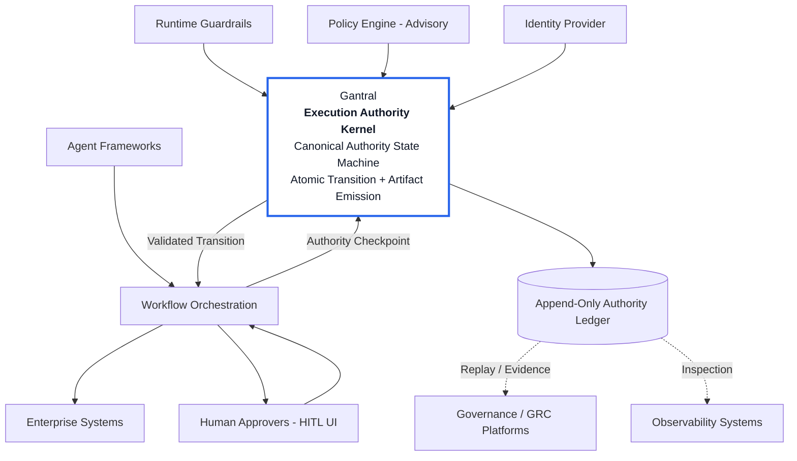

# Welcome to Gantral

> **Deterministic Authority Infrastructure for Scaling AI**  
> *Structural enforcement that removes ambiguity and accelerates enterprise adoption.*

Gantral is an open-source **Execution Authority Kernel** for orchestrated and agentic enterprise systems.

It governs whether execution may proceed.

Gantral does not build agents.  
Gantral does not replace orchestration.  
Gantral does not provide dashboards.  

Gantral enforces authority as canonical workflow state.

---

## Why Gantral Exists

AI pilots succeed.  
AI scaling stalls.

Not because models fail —  
but because authority fragments.

As AI systems move from experimentation into consequential workflows, they begin to:

- Move money  
- Modify infrastructure  
- Change access control  
- Influence regulatory posture  
- Trigger irreversible operational outcomes  

At that boundary:

AI can act.  
Humans remain accountable.

Most enterprise stacks can:

- Orchestrate workflows  
- Evaluate policy  
- Apply guardrails  
- Log events  
- Produce dashboards  

Very few structurally enforce execution authority.

Authority is reconstructed from logs instead of enforced at runtime.

Gantral introduces a missing layer:

**Execution Authority as canonical state — not metadata.**

---

## 10-Second Differentiation

Orchestration coordinates tasks.  
Guardrails filter actions.  
Observability reports outcomes.  

**Gantral governs whether execution is admissible.**

Authority becomes:

- Deterministic  
- Version-bound  
- Identity-bound  
- Cryptographically committed  
- Log-independent  
- Replayable  

Audit logs reconstruct.  
Gantral proves.

---

## Where Gantral Sits

```mermaid
flowchart TB

   GRC[Governance & Observability<br/>GRC, Audit, Monitoring]
   Guardrails[Runtime Guardrails<br/>Safety, Tool Controls]
   Gantral[Gantral<br/><b>Execution Authority Kernel</b><br/>Canonical State • Hash-Chained Artifacts • Offline Replay]
   Orchestration[Workflow Orchestration<br/>Temporal, Orkes, UiPath]
   Agents[Agent Frameworks & Enterprise Apps]
   Tools[Enterprise Systems & Tools]

   GRC --> Guardrails --> Gantral --> Orchestration --> Agents --> Tools

   style Gantral fill:#ffffff,stroke:#2563eb,stroke-width:3px,color:#111827
````

Gantral sits:

* Below guardrails
* Above orchestration
* Between agent frameworks and workflow runtimes

It alone advances or blocks execution state.

It does not observe.
It does not report.
It enforces.

---

## Why Existing Systems Are Not Enough

Modern enterprise AI stacks already include:

* Workflow orchestration
* Policy engines
* Runtime guardrails
* Observability and GRC platforms

These systems coordinate, filter, and monitor execution.

None define whether execution is constitutionally admissible.

In most deployments:

* Approval is implemented as a workflow pause
* Policy is advisory logic
* Logs record events after execution resumes

Authority is inferred.

Gantral makes authority structural.

Approval becomes a canonical state transition.
Artifact emission becomes atomic.
Replay becomes independent of runtime and logs.

Determinism replaces reconstruction.

---

## The Structural Barriers to Scaling AI

When AI moves beyond basic human-supervised automation, enterprises encounter:

### Policy-in-Code Drift

Authority thresholds embedded in workflow logic.
Every change requires redeployment.
Version drift accumulates.

### Environment Fragmentation

Authority semantics differ across dev, staging, and production.
Approval behavior shifts between releases.

### Cross-Runtime Inconsistency

Different orchestrators.
Different approval semantics.
No uniform authority model.

### Broken Chain of Custody

AI recommends.
Human approves.
Execution resumes elsewhere.
Logs attempt reconstruction — but cannot prove.

### Non-Defendability

Cannot deterministically answer:

* Which workflow version ran?
* Which policy version applied?
* Who exercised authority?
* What context existed at decision time?

High-impact AI requires proof — not log stitching.

Gantral enforces authority correctness at execution time.

---

## When Structural Authority Is Necessary

Gantral is not required for every workflow.

Orchestration alone is often sufficient for:

* Internal HR approvals
* Low-value vendor invoices
* Routine automation

Structural authority becomes rational infrastructure when:

* Financial exposure exceeds material thresholds
* Regulatory enforcement is plausible
* Litigation risk exists
* Board-level explanation may be required
* Decisions could be challenged years later

If this decision appeared in litigation two years from now,
could you independently prove that authority was exercised correctly?

If the answer depends on logs and reconstruction,
structural authority may be warranted.

---

## Deterministic Authority Model

Gantral defines a canonical authority state machine:

```
CREATED → RUNNING → WAITING_FOR_HUMAN
→ APPROVED / REJECTED / OVERRIDDEN
→ RESUMED → COMPLETED / TERMINATED
```

Authority transitions:

* Are explicitly enumerated
* Must satisfy valid transition relations
* Are atomic with artifact emission
* Fail closed if persistence fails
* Are version-bound and identity-bound

No execution resumes past governed boundaries without structural evidence.

Formal semantics are described in the implementation paper and specification.

---

## Policy Advisory Integration (OPA)

Gantral supports external policy engines in an advisory capacity.

Policy may be authored in:

* Open Policy Agent (OPA) / Rego
* Custom enterprise policy services

At authority checkpoints:

1. Policy is evaluated externally.
2. Advisory results are returned.
3. `policy_version_id` is bound to the execution instance.
4. Gantral enforces the authority transition structurally.

Policy remains advisory.
Authority enforcement remains internal and deterministic.

Policy thresholds can evolve without modifying workflow code.

---

## Verifiability (Start Here for Audit & Proof)

Gantral is designed so execution decisions can be independently verified under adversarial, post-incident conditions.

These documents define:

* The admissibility standard for execution-time authority

* The mechanisms required to produce defensible execution evidence

* **[Admissible Execution](./verifiability/admissible-execution.md)**

* **[Verifiability Overview](./verifiability/README.md)**

* **[Threat & Adversary Model](./verifiability/threat-model.md)**

* **[Commitment Artifact](./verifiability/commitment-artifact.md)**

* **[Replay Protocol](./verifiability/replay-protocol.md)**

* **[Failure Semantics](./verifiability/failure-semantics.md)**

* **[Explicit Non-Claims](./verifiability/non-claims.md)**

Gantral provides verifiable authority evidence.
It does not claim regulatory certification.

---

## Technical Architecture

Gantral integrates at authority boundaries within orchestrated workflows.



Policy advises.
Gantral enforces.
Runtime executes.

Gantral does not replace orchestration, guardrails, or governance platforms.

---

## What Gantral Is — and Is Not

Gantral is:

* An execution authority layer
* Deterministic infrastructure
* A version-bound system of record for authority transitions
* An open, vendor-neutral enforcement substrate

Gantral is not:

* An agent framework
* A workflow engine
* A governance dashboard
* A policy authoring UI
* A compliance certification system
* A GRC platform

Gantral governs authority at the execution boundary.

---

## Position Papers

* **[Executive Summary](./positioning/ai-execution-control-plane-summary.md)**
* **[AI Execution Control Plane — Position Paper](./positioning/ai-execution-control-plane.md)**
* **[Admissible Execution — Invariants for Execution Authority](./verifiability/admissible-execution.md)**
* **[Gantral — Implementation of an Admissible AI Execution Control Plane](./architecture/gantral-implementation-paper.md)**

---

## Getting Oriented

* **[What is Gantral?](./positioning/what-is-gantral.md)**
* **[What Gantral Is Not](./positioning/what-gantral-is-not.md)**
* **[Product Specification (PRD)](./product/prd.md)**

---

## Adoption and Evaluation

* **[Adoption Overview](./adoption/README.md)**
* **[Design Partner Engagement](./adoption/design-partners.md)**
* **[Enterprise Onboarding Playbook](./adoption/enterprise-onboarding.md)**
* **[Adoption Boundaries and Non-Goals](./adoption/adoption-boundaries.md)**

---

## Integration Guides

* **[Consumer Integration Guide](./guides/example-consumer-integration.md)**
* **[Policy Integration (OPA)](./guides/opa-integration.md)**
* **[Auditor Verification Guide](./guides/auditor-verification.md)**
* **[Demo Walkthrough](./guides/demo.md)**

---

Gantral is an independent open-source project developed by Rainminds Solutions Pvt. Ltd.

Authority must be structural when consequences are material.