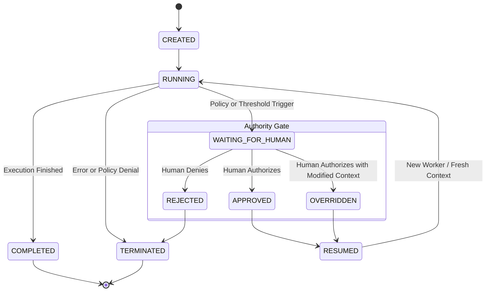

# Authority State Machine

Gantral enforces execution authority through a **strict, deterministic authority state machine**.

This state machine is not an implementation detail.
It is the **mechanism by which authority is enforced, paused, escalated, and proven**.

No execution may proceed past a controlled boundary unless the corresponding
authority state transition is valid, recorded, and committed.

---

## Purpose of the Authority State Machine

The authority state machine exists to ensure that:

- execution authority is **explicit**, not implied
- escalation and human oversight are **enforced**, not advisory
- authority decisions are **inseparable from execution**
- every consequential transition produces **verifiable evidence**

This state machine governs **execution permission**, not business logic.

---

## Lifecycle Diagram

The following diagram illustrates the **only valid authority transitions**
for a Gantral execution instance.

Any transition not represented here is **invalid**.

---

## State Definitions

| State                 | Authority Semantics                                                                                                                  |
| --------------------- | ------------------------------------------------------------------------------------------------------------------------------------ |
| **CREATED**           | Execution instance exists. No execution authority has yet been exercised.                                                            |
| **RUNNING**           | Execution is permitted under current authority constraints.                                                                          |
| **WAITING_FOR_HUMAN** | **Hard Authority Gate.** Execution is suspended because automated authority is insufficient. No execution may proceed in this state. |
| **APPROVED**          | A human actor explicitly granted authority to continue under the existing context.                                                   |
| **REJECTED**          | A human actor explicitly denied authority. Execution must terminate.                                                                 |
| **OVERRIDDEN**        | A human actor granted authority **with modified parameters**, replacing the prior execution context.                                 |
| **RESUMED**           | Transitional state indicating authority has been granted and execution may restart under a fresh runtime context.                    |
| **COMPLETED**         | Execution finished successfully under valid authority.                                                                               |
| **TERMINATED**        | Execution stopped due to rejection, error, or policy denial.                                                                         |

---

## WAITING_FOR_HUMAN Is a Gate, Not a Pause

`WAITING_FOR_HUMAN` is a **deterministic authority gate**, not a convenience pause.

While in this state:

* no agent code may run
* no side effects may occur
* no progress is permitted
* authority is **explicitly absent**

From an execution standpoint, the agent process **should exit**.
Resumption requires a **new process** with fresh context supplied by Gantral.

This design ensures:

* zero implicit trust
* no hidden continuation
* no reliance on agent memory

---

## Deterministic Authority Transitions

All transitions out of `WAITING_FOR_HUMAN` require:

* an authenticated human actor
* an explicit authority decision
* a committed state transition

An agent **cannot**:

* approve itself
* bypass the gate
* resume execution implicitly
* modify authority state

Authority transitions are **externally driven and recorded**.

---

## Relationship to Policy Evaluation

Policy engines (e.g., OPA) may **trigger** a transition to `WAITING_FOR_HUMAN`,
but they **cannot authorize execution**.

Policy evaluation:

* advises
* signals thresholds
* recommends escalation

Authority enforcement:

* occurs only through state transitions
* is committed by Gantral
* produces verifiable artifacts

Policy signals do not grant authority.
State transitions do.

---

## Commitment Artifact Emission

A **commitment artifact** is emitted whenever:

* authority is enforced
* execution transitions across an authority boundary
* execution is allowed, resumed, or terminated

Specifically:

* transitions into `WAITING_FOR_HUMAN`
* transitions into `RESUMED`
* transitions into `TERMINATED`
* transitions into `COMPLETED`

There is **no valid transition** in which:

* authority changes
* execution proceeds
* and no artifact is emitted

No artifact → no execution.

---

## Invariants & Guarantees

The authority state machine enforces the following invariants:

1. **Append-Only Authority History**
   Authority state is never mutated. Every transition is recorded as a new event.

2. **Explicit Authority Only**
   Execution authority exists only in states where it is explicitly granted.

3. **No Implicit Resume**
   Resumption always requires a fresh runtime and explicit authority transition.

4. **Deterministic Semantics**
   Given identical inputs, authority transitions are reproducible and replayable.

5. **Failure Over Ambiguity**
   If authority state is unclear, execution must not proceed.

---

## Failure Behavior

The state machine is designed to **fail closed**.

Execution must be refused when:

* authority state is ambiguous
* required human authority is unavailable
* escalation cannot be resolved
* artifact emission fails

Failure to proceed is **correct behavior**.

---

## Relationship to Verifiability

The authority state machine is the **structural foundation** of Gantral’s
verifiability guarantees.

Replay and verification depend on the fact that:

* authority is always represented as state
* state transitions are deterministic
* transitions are committed with artifacts
* no execution bypasses the machine

Without this state machine, verifiability is impossible.

---

## Guiding Principle

Authority is not a signal.
Authority is not a recommendation.
Authority is **state**.

If execution cannot be shown to have passed through this state machine,
then execution authority cannot be proven.
