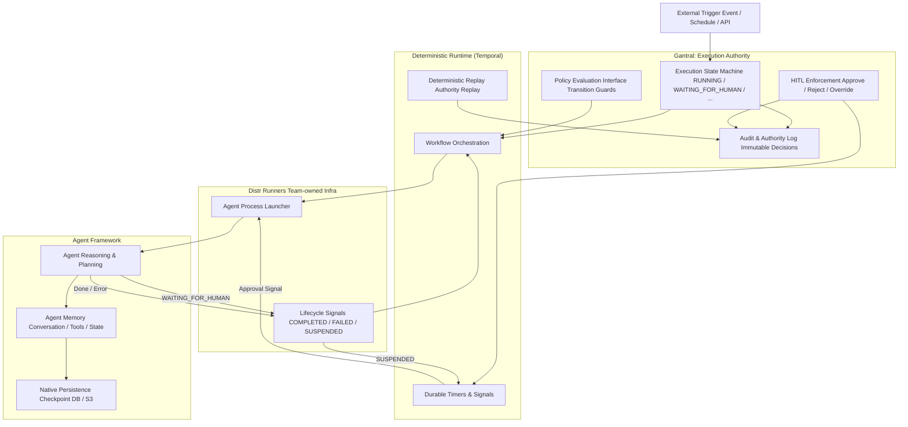

# Execution Authority vs Agent Memory vs Runtime

This diagram shows the **strict separation of responsibilities** in Gantral.

It answers one question unambiguously:

**Who owns what state, and why Temporal is still required even when agents manage their own memory.**

---

## **High-level Responsibility Split**

* **Execution Authority** → *Gantral*  
* **Execution Runtime** → *Deterministic Workflow Engine (Temporal)*  
* **Agent Memory & Reasoning** → *Agent Frameworks (CrewAI, LangGraph, etc.)*

---

## **Single-Page Architecture Diagram**

---

## **How to Read This Diagram**

### **1\. Gantral \= Execution Authority**

* Owns execution state  
* Decides **when** execution may proceed  
* Enforces human approval  
* Produces the **authoritative audit log**

Gantral never sees:

* Agent memory  
* Prompts  
* Tool state

---

### **2\. Temporal \= Execution Runtime**

* Owns ordering, time, retries, and durability  
* Guarantees deterministic replay of **authority decisions**  
* Waits safely for hours or days during HITL

Temporal does **not**:

* Run agent reasoning  
* Store agent memory  
* Decide outcomes

---

### **3\. Agent Framework \= Reasoning \+ Memory**

* Owns cognition, planning, and tools  
* Persists internal state using **native persistence**  
* Can safely exit and resume later

If native persistence is **not supported**:

* The agent **must be split** into pre-approval and post-approval stages

---

### **4\. Runners \= Execution Boundary**

* Launch agent processes  
* Detect lifecycle outcomes:  
  * COMPLETED  
  * FAILED  
  * SUSPENDED (hibernation)  
* Translate agent signals into Gantral execution events

Runners never make decisions.

---

## **Why This Separation Matters**

* **Auditability**: Authority can be replayed without agent memory  
* **Cost efficiency**: No compute during long approvals  
* **Framework freedom**: Any agent framework can be used  
* **Regulator trust**: Clear ownership of decisions

---

## **One-line Summary**

**Gantral decides. Temporal remembers. Agents think.**

---

## **Recommended Placement in the Repo**

Add this file as:

/docs/architecture/execution-authority-vs-agent-memory.md

Then:

1. Link it from:  
   * `README.md`  
   * `docs/architecture/README.md`  
2. Reference it from:  
   * PRD (conceptual grounding)  
   * TRD (visual companion)  
   * Consumer Guide (for developers)

This diagram becomes the **canonical mental model** for contributors, users, and reviewers.

