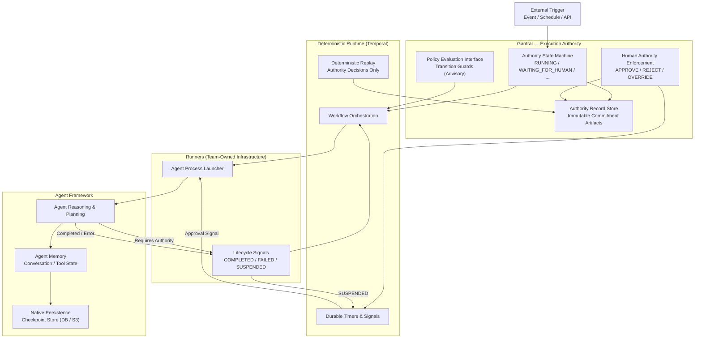

# Execution Authority vs Agent Memory vs Runtime

This document explains the **strict separation of responsibilities** enforced by Gantral.

It answers one question unambiguously:

> **Who owns which state, and why a deterministic runtime (e.g. Temporal) is still required even when agents manage their own memory.**

This separation is foundational to **verifiability, replay, and audit correctness**.

---

## High-Level Responsibility Split

- **Execution Authority** → *Gantral*  
- **Execution Runtime** → *Deterministic Workflow Engine (e.g. Temporal)*  
- **Agent Memory & Reasoning** → *Agent Frameworks (CrewAI, LangGraph, etc.)*

Each layer is necessary.  
No layer may subsume the responsibilities of another.

---

## Single-Page Architecture Diagram

---

## How to Read This Diagram

### 1. Gantral = Execution Authority

Gantral owns **execution authority as state**.

It is responsible for:

* defining when execution may proceed
* enforcing Human-in-the-Loop (HITL)
* recording authority decisions immutably
* emitting commitment artifacts atomically with authority transitions

Gantral explicitly does **not** see or manage:

* agent memory
* prompts
* tool payloads
* agent reasoning traces

Gantral governs **permission**, not cognition.

---

### 2. Deterministic Runtime = Ordering, Time, Replay

A deterministic workflow runtime (e.g. Temporal) is required even when agents manage their own memory.

The runtime owns:

* ordering of execution steps
* durable timers and waits
* retries and escalation timing
* deterministic replay of **authority decisions**

The runtime does **not**:

* reason
* evaluate policy
* grant authority
* persist agent memory

Replay re-executes workflow logic using recorded authority history.
It never reconstructs agent cognition.

---

### 3. Agent Framework = Reasoning and Memory

Agent frameworks own:

* reasoning and planning
* tool invocation
* internal state and memory
* persistence of agent checkpoints

Agents may safely:

* checkpoint state
* exit during long waits
* resume later in a new process

If an agent framework does **not** support native persistence:

* the agent **must be split** into pre-approval and post-approval stages

Gantral never serializes or inspects agent memory.

---

### 4. Runners = Execution Boundary

Runners are the execution edge.

They:

* launch agent processes
* detect lifecycle outcomes:

  * `COMPLETED`
  * `FAILED`
  * `SUSPENDED`
* translate outcomes into Gantral execution events

Runners never:

* evaluate policy
* make authority decisions
* infer approval

They are strictly mechanical.

---

## Why This Separation Matters

This architecture enables:

* **Verifiable audit** — authority can be replayed without agent memory
* **Fail-closed behavior** — execution stops if authority cannot be enforced
* **Cost efficiency** — no compute during long human approvals
* **Framework freedom** — any agent system may be used
* **Regulator confidence** — explicit ownership of decisions

Collapsing these layers breaks determinism and auditability.

---

## One-Line Mental Model

**Gantral decides.
The runtime remembers.
Agents think.**

---