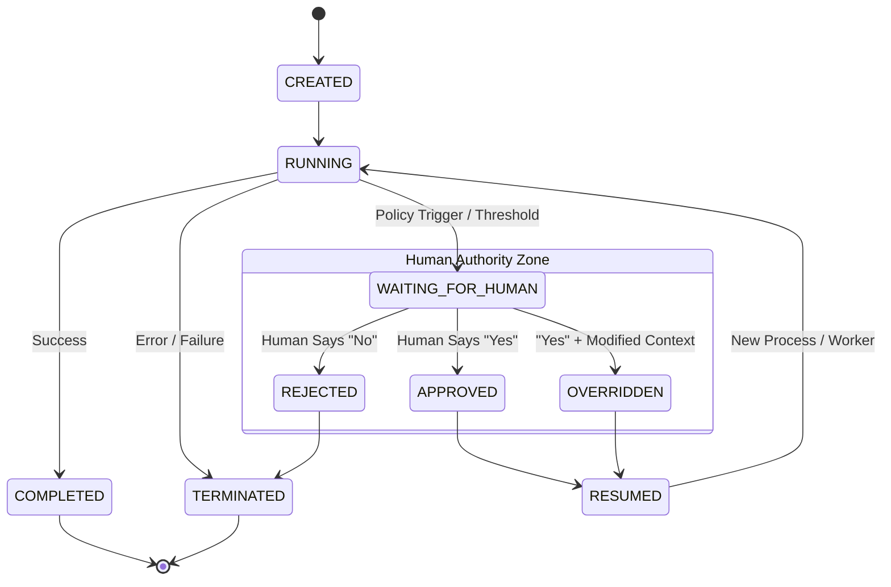

# Execution State Machine

Gantral enforces a strict, deterministic state machine for all AI execution instances. This lifecycle guarantees that no agent can proceed past a critical boundary without explicit authorization.

## Lifecycle Diagram

The following Mermaid diagram illustrates the only valid transitions in the Gantral protocol.

## State Definitions

| State | Role & Behavior |
| :--- | :--- |
| **CREATED** | Instance initialized. Parameters are validated but execution has not begun. |
| **RUNNING** | Workflow is actively executing. CPU resources are consumed. |
| **WAITING_FOR_HUMAN** | **Critical Paused State.** Execution is suspended by policy.  *Note:* In this state, the agent process should ideally exit (Zero CPU) to save costs. |
| **APPROVED** | A human actor explicitly authorized the continuation. |
| **REJECTED** | A human actor denied the request. Execution moves to TERMINATED immediately. |
| **OVERRIDDEN** | A human actor authorized the request but *changed the parameters* (e.g., lowered a transaction amount). |
| **RESUMED** | A transient state indicating the runtime is preparing to re-launch the agent process. |
| **COMPLETED** | Workflow finished successfully. |
| **TERMINATED** | Workflow stopped due to error, rejection, or policy denial. |

## Invariants & Guarantees

1.  **Append-Only History:** States are never mutated in place. Every transition is a new event in the immutable log.
2.  **Explicit Authority:** An agent *cannot* transition itself out of `WAITING_FOR_HUMAN`. Only an authenticated external signal (API call with `actor_id`) can trigger the `APPROVED` or `REJECTED` transition.
3.  **Zero-Trust Resume:** When transitioning from `RESUMED` back to `RUNNING`, the agent is not "trusted" to remember its state. It must re-hydrate from a checkpoint or receive a fresh context payload from Gantral.
