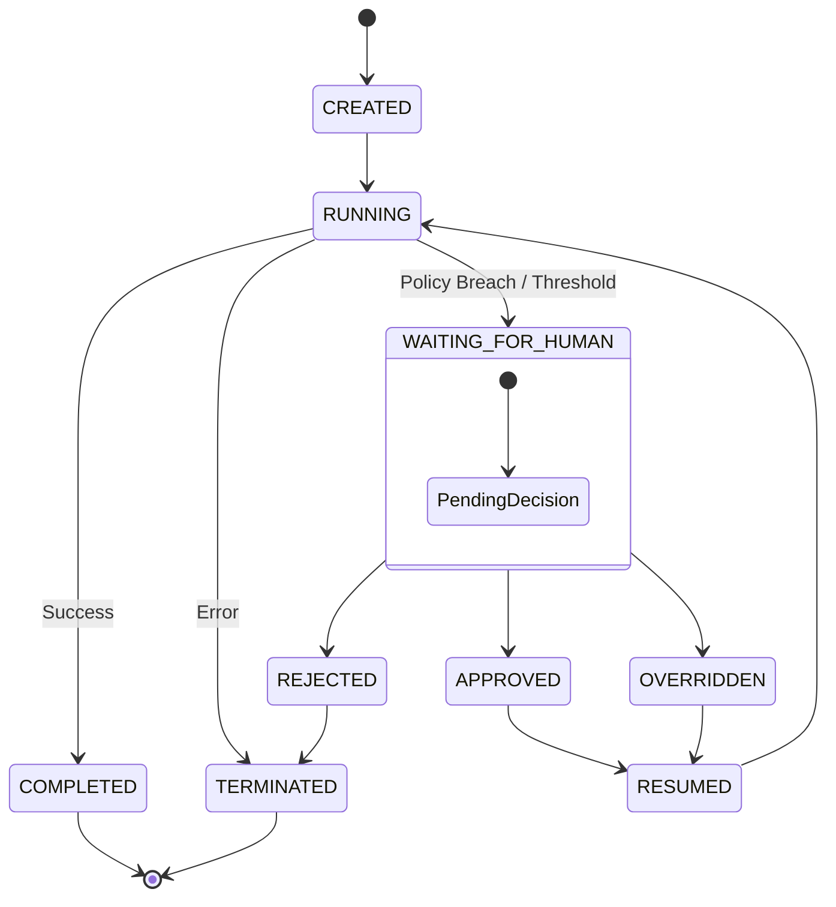

# Execution State Machine

Gantral enforces a strict, deterministic state machine for all AI execution instances. Use this reference to understand lifecycle transitions.

## 5.1 Canonical States

### State Definitions

| State | Description |
|-------|-------------|
| **CREATED** | Instance initialized but not started. |
| **RUNNING** | Workflow is actively executing steps. |
| **WAITING_FOR_HUMAN** | Execution paused by policy. Requires intervention. |
| **APPROVED** | Human authorized the action. |
| **REJECTED** | Human denied the action. Execution terminates. |
| **OVERRIDDEN** | Human forced a decision, potentially bypassing policy. |
| **RESUMED** | Transient state transitioning back to execution. |
| **COMPLETED** | Workflow finished successfully. |
| **TERMINATED** | Workflow stopped due to error or rejection. |

## 5.2 State Guarantees

* **Append-Only:** State transitions are append‑only log entries.
* **Immutability:** No state mutation in place; history is preserved.
* **Cryptography:** Every transition is timestamped and signed for audit.
