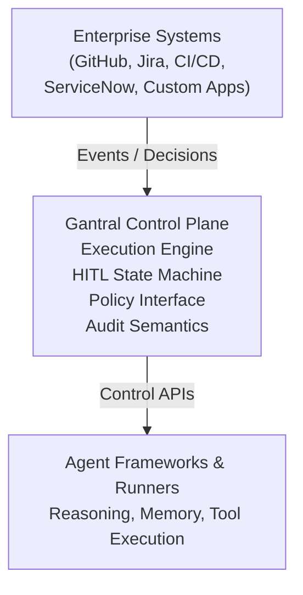

**Version:** v4.0 (Federated Execution, Authority-First, Agent-Native Persistence)

**Status:** Living technical reference (authoritative)

**Audience:** Core contributors, platform engineers, security reviewers, enterprise architects

---

## **Purpose**
# Gantral — Technical Reference & Architecture Document (TRD)

**Version:** v4.0 (Federated Execution, Authority-First, Agent-Native Persistence)  
**Status:** Living technical reference (authoritative)  
**Audience:** Core contributors, platform engineers, security reviewers, enterprise architects  

---

## Purpose

This document is the **technical constitution** of the Gantral open-source core.

It defines the architectural invariants, execution semantics, responsibility boundaries, and control guarantees that **must hold across all implementations**.

Gantral deliberately separates **execution authority** from **agent reasoning and memory**.

> **If an implementation conflicts with this document, the implementation is incorrect.**

---

## 1. Scope & Non-Goals

### 1.1 What Gantral Is (Technical Definition)

Gantral is an **AI Execution Control Plane** that standardizes how AI-assisted and agentic workflows:

- Execute  
- Pause for human authority  
- Escalate  
- Resume  
- Terminate  
- Are audited  

across teams, domains, and systems.

Technically, Gantral provides:

- A deterministic, instance-first execution state machine  
- Human-in-the-Loop (HITL) as a first-class execution state  
- Instance-level isolation for audit, cost, and accountability  
- Declarative control policies for materiality, authority, and escalation  
- A **pluggable policy evaluation interface** (advisory only)  
- Control APIs and SDKs that sit **above agent frameworks and below enterprise systems**  
- Deterministic execution and replay guarantees via a workflow runtime  

Gantral is **domain-agnostic by design**.  
SDLC workflows are an initial wedge, not the boundary.

---

### 1.2 Explicit Non-Goals (Hard Exclusions)

Gantral will **not**:

- Build, host, or orchestrate AI agents  
- Encode domain-specific business logic  
- Manage agent prompts, plans, or internal memory  
- Serialize or persist agent internal state  
- Optimize, train, or fine-tune models  
- Provide autonomous decision loops  
- Make probabilistic decisions without human accountability  
- Replace CI/CD, ITSM, ticketing, or enterprise systems  
- Store raw secrets or credentials  
- Act as an identity provider  

---

## 2. Architectural Invariants (Non-Negotiable)

The following invariants must hold across all implementations:

- **Instance-first semantics**  
  All audit, cost, authority, and replay semantics attach to immutable execution instances  

- **HITL is a state transition**  
  Human intervention is modeled inside the execution graph, not as an external approval  

- **Human authority is final**  
  AI output is advisory; policy-enforced human decisions override AI  

- **Determinism > performance**  
  Replayability and auditability take precedence over latency  

- **Declarative control**  
  Materiality, authority, and escalation rules are configuration, not embedded logic  

- **Adapters contain no business logic**  
  Integrations emit events and receive decisions only  

- **Identity federation required**  
  Identity is derived from upstream IdPs; Gantral maintains no user directory  

- **No secret persistence**  
  Gantral stores references only; secrets resolve at execution edges  

---

### Agent-Native Persistence (Critical Invariant)

- **Execution vs Agent State Separation**
  - Gantral owns execution state (`RUNNING`, `WAITING_FOR_HUMAN`, etc.)
  - Agent frameworks own agent internal state (memory, plans, tools)

- **Checkpointability Requirement**
  - Agents **must** be restartable from externally persisted checkpoints
  - Agent state persistence is handled by the agent framework (DB, object storage)

- **No Agent State in Gantral**
  - Agent internal state must never be serialized into Gantral execution history

Violating these invariants **invalidates the system**.

---

## 3. High-Level Architecture

### 3.1 Responsibility Layers

This document is the **technical constitution** of the Gantral open-source core. It defines the architectural invariants, execution semantics, responsibility boundaries, and control guarantees that **must** hold across all implementations.

Gantral deliberately separates **execution authority** from **agent reasoning and memory**.

**If an implementation conflicts with this document, the implementation is incorrect.**

---

## **1\. Scope & Non-Goals**

### **1.1 What Gantral Is (Technical Definition)**

Gantral is an **AI Execution Control Plane** that standardizes how AI-assisted and agentic workflows **execute, pause, escalate, resume, and are audited** across teams, domains, and systems.

Technically, Gantral provides:

* A deterministic, instance-first execution state machine  
* Human-in-the-Loop (HITL) as a first-class execution state  
* Instance-level isolation for audit, cost, and accountability  
* Declarative control policies for materiality, authority, and escalation  
* A **pluggable policy evaluation interface** (advisory only)  
* Control APIs and SDKs that sit **above agent frameworks and below enterprise systems**  
* Deterministic execution and replay guarantees via a workflow runtime

Gantral is domain-agnostic by design. SDLC workflows are an initial wedge, not the boundary.

---

### **1.2 Explicit Non-Goals (Hard Exclusions)**

Gantral will **not**:

* Build, host, or orchestrate AI agents  
* Encode domain-specific business logic  
* Manage agent prompts, plans, or internal memory  
* Serialize or persist agent internal state  
* Optimize, train, or fine-tune models  
* Provide autonomous decision loops  
* Make probabilistic decisions without human accountability  
* Replace CI/CD, ITSM, ticketing, or enterprise systems  
* Store raw secrets or credentials  
* Act as an identity provider

---

## **2\. Architectural Invariants (Non-Negotiable)**

The following invariants must hold across all implementations:

* **Instance-first semantics:** All audit, cost, authority, and replay semantics attach to immutable execution instances  
* **HITL is a state transition:** Human intervention is modeled inside the execution graph, not as an external approval  
* **Human authority is final:** AI output is advisory; policy-enforced human decisions override AI  
* **Determinism \> performance:** Replayability and auditability take precedence over latency  
* **Declarative control:** Materiality, authority, and escalation rules are configuration, not embedded logic  
* **Adapters contain no business logic:** Integrations emit events and receive decisions only  
* **Identity federation required:** Gantral must not maintain a standalone user directory; identity is derived from upstream IdPs  
* **No secret persistence:** Gantral stores only secret references; resolution occurs at execution edges

### **New Invariant – Agent-Native Persistence (Critical)**

* **Execution State vs Agent State Separation:**  
  * Gantral owns **execution state** (RUNNING, WAITING\_FOR\_HUMAN, etc.)  
  * Agent frameworks own **agent internal state** (memory, plans, tool context)  
* **Checkpointability Requirement:**  
  * Agents integrated with Gantral **must be restartable** from an externally persisted checkpoint when execution resumes  
  * Agent internal state must be durably persisted by the agent framework (e.g. DB, object storage)  
* **No Agent State in Gantral:**  
  * Agent internal state must never be serialized into Gantral execution history

Violating these invariants invalidates the system.

---

## **3\. High-Level Architecture**

### **3.1 Logical Architecture Layers**

\+--------------------------------------------------+  
| Enterprise Systems                               |  
| (GitHub, Jira, Slack, ServiceNow, Custom Apps)   |  
\+------------------------▲-------------------------+  
                         | Events / Decisions  
\+------------------------|-------------------------+  
| Gantral Control Plane  |                         |  
|  \- Execution Engine    |                         |  
|  \- HITL State Machine  |                         |  
|  \- Policy Interface   |                         |  
|  \- Instance Registry  |                         |  
|  \- Audit Semantics    |                         |  
\+------------------------▲-------------------------+  
                         | SDK / API  
\+------------------------|-------------------------+  
| Agent Frameworks &     |                         |  
| Runners (Distributed)  |                         |  
\+--------------------------------------------------+

---

### **3.2 Runtime Model (Authoritative)**

1. Trigger received (event, schedule, external signal)  
2. Workflow template selected  
3. Instance created (immutable `instance_id`)  
4. Execution proceeds inside a deterministic workflow runtime  
5. Policy evaluation performed **as a transition guard**  
6. Execution continues or transitions to `WAITING_FOR_HUMAN`  
7. Agent framework persists internal state and suspends execution  
8. Human decision captured (if required)  
9. Execution resumes or terminates via a new process  
10. Audit record sealed

---

### **3.3 Execution Plane Responsibility Boundary**

* **Gantral owns:**  
  * Execution state  
  * Authority transitions  
  * Time, retries, escalation, and replay  
  * Audit correctness  
* **Agent frameworks own:**  
  * Reasoning, planning, and tool execution  
  * Agent memory and conversation history  
  * Internal checkpoints and resume logic  
* **Runners:**  
  * Execute agent processes  
  * Detect completion, failure, or suspension  
  * Translate agent lifecycle signals into Gantral execution events

Agents **cannot** advance execution past governed states independently.

---

### **3.4 Execution Readiness vs Execution State**

Gantral distinguishes between **execution state** and **execution readiness**.

**Execution State**

* Canonical and immutable  
* Persisted and auditable  
* Used for compliance and replay

**Execution Readiness**

* Derived and transient  
* Evaluated continuously  
* Not persisted  
* Not part of the state machine

Formally:

runnable(instance) \=  
  execution\_state \== RUNNING  
  AND no pending HITL decisions  
  AND no policy blocks  
  AND execution plane capacity available

---

## **4\. Core Domain Model**

### **4.1 Core Entities**

**Workflow (Template)**

* `workflow_id`, `version`  
* Step graph  
* Trigger definitions  
* Policy references  
* Materiality level

**Instance (Execution)**

* Immutable `instance_id`  
* `workflow_id` \+ `version`  
* `owning_team_id`  
* Trigger context  
* Execution state  
* Timestamps  
* Cost metadata

**HITL Decision**

* `decision_id`  
* `instance_id`  
* `decision_type` (APPROVE / REJECT / OVERRIDE)  
* `human_actor_id`  
* Role  
* Justification  
* `context_snapshot`  
* `context_delta` (required for OVERRIDE)

---

### **4.2 Identity & Integration Entities**

**Service Identity (System Account)**

* `identity_id`  
* `owner_team_id`  
* `external_principal_map` (AWS IAM role, K8s service account, etc.)

**Connection (Resource Binding)**

* `connection_id`  
* `type` (e.g. postgres, github, salesforce)  
* `config_ref` (e.g. `vault://path/to/secret`)

**Runner (Execution Node)**

* `runner_id`  
* Subscribed task queues  
* Capabilities metadata (network zone, GPU, OS)

---

## **5\. Execution State Machine**

### **5.1 Canonical States**

CREATED  
  ↓  
RUNNING  
  ↓ (policy requires human authority)  
WAITING\_FOR\_HUMAN  
  ↙     ↓      ↘  
OVERRIDDEN  APPROVED  REJECTED  
  ↓         ↓          ↓  
RESUMED   RESUMED   TERMINATED  
  ↓  
COMPLETED

---

### **5.2 State Guarantees**

* State transitions are append-only  
* No in-place mutation  
* Every transition is timestamped and signed

---

### **5.3 Policy Evaluation Semantics (Critical)**

* Policy evaluation does **not** introduce a new execution state  
* Evaluation occurs synchronously during state transitions  
* Results determine whether execution continues or transitions to `WAITING_FOR_HUMAN`  
* Policy engines **never** hold authority

Policy checks are **transition guards**, not durable states.

---

## **6\. Policy Interface & Evaluation Layer**

### **6.1 Policy Interface Characteristics**

* Pluggable and replaceable  
* Deterministic and side-effect free  
* Evaluated at runtime  
* Versioned and auditable

---

### **6.2 Responsibility Split**

**Gantral owns:**

* Policy semantics  
* Execution control  
* Authority transitions  
* Audit semantics

**Policy evaluators provide:**

* Allow / deny / require-human signals  
* Approver eligibility  
* Escalation and timeout signals

---

## **7\. Determinism & Replay Model**

Gantral guarantees deterministic replay of **execution decisions**.

This guarantee is enforced by executing Gantral workflows on a **deterministic workflow runtime** (e.g. Temporal).

### **7.1 Replay Semantics**

* Replay re-executes workflow logic from recorded execution history  
* Identical inputs, events, and policy versions must yield identical outcomes  
* Replay does **not** rehydrate agent internal memory

---

### **7.2 Responsibility Boundary**

* Gantral defines **what must be replayable** (authority and decisions)  
* The workflow runtime defines **how replay occurs**  
* Agent frameworks may optionally replay internal reasoning for debugging only

Gantral does **not** implement a separate replay engine.

---

## **8\. APIs & SDKs**

* REST and gRPC APIs (OpenAPI 3.1)  
* Core API groups:  
  * `/workflows`  
  * `/instances`  
  * `/decisions`  
  * `/policies`  
  * `/audit`

SDKs are **thin wrappers**; all logic remains server-side.

---

## **9\. Repository Structure**

/gantral  
  /docs  
  /specs  
  /core  
  /engine  
  /policy  
  /hitl  
  /audit  
  /api  
  /sdk  
    /python  
    /go  
    /typescript  
  /adapters  
  /infra  
  /tests

Principles:

* Specs first  
* Code follows spec  
* No UI in OSS core

---

## **10\. Data Stores**

| Purpose | Technology |
| ----- | ----- |
| Execution state | Event-sourced workflow history |
| Immutable logs | Append-only log store |
| Snapshots | Object storage (S3-compatible) |
| Caching | Redis (optional) |

Agent internal state stores are **explicitly out of scope**.

---

## **11\. Security Architecture**

* Identity: OAuth 2.0 / OIDC (federated)  
* Authorization: Policy-driven RBAC  
* Secrets: External secret managers only  
* Audit: 100% decision capture, tamper-evident logs

---

## **12\. Privacy & Compliance**

* Data minimization by default  
* Configurable redaction  
* Self-hosted and air-gapped deployments supported

Compliance is a **structural property** of the execution model.

---

## **13\. Infrastructure & IaC**

* Deployment: Kubernetes (primary), Docker Compose (dev)  
* Workflow runtime: Temporal  
* IaC: Terraform, Helm  
* Observability: OpenTelemetry, Prometheus, structured logs

---

## **14\. Standards & Interoperability**

* OpenAPI 3.1  
* OpenTelemetry  
* OAuth 2.0 / OIDC  
* CNCF-aligned design principles

---

## **15\. Licensing & Governance**

* License: Apache 2.0  
* Governance: Maintainer-led with public RFCs  
* No dual-license bait-and-switch

---

## **16\. Final Principle**

Gantral is not about what AI can do.

It is about what organizations are willing to allow AI to do — and how they prove it.

**This document is the reference.**

