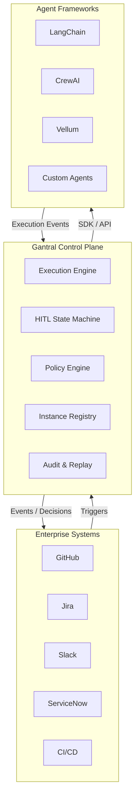

# Technical Reference Document

**Status:** Living technical reference (v1.1)

**Purpose:** This document is the technical constitution of the **Gantral open-source core**. It is not intended to describe the features of the commercial Gantrio platform. It is designed to directly inform:
* Implementation sequencing
* Repository structure
* Architecture & design decisions
* Security, privacy, and compliance posture
* OSS governance and licensing

This document is intentionally detailed and opinionated. If an implementation conflicts with this document, the implementation is wrong.

## 1. Scope & Non‑Goals

### 1.1 What Gantral Is (Technical Definition)

Gantral is an AI Execution Control Plane that standardizes how AI-driven workflows execute, pause, escalate, and are audited across teams and systems.

Technically, Gantral provides:
* A deterministic execution state machine.
* Human‑in‑the‑Loop (HITL) as a first‑class state transition.
* Instance‑level isolation for audit, cost, and accountability.
* Declarative policies for materiality, escalation, and authority.
* Control APIs and SDKs that sit above agent frameworks and below enterprise processes.

### 1.2 Explicit Non‑Goals (Hard Exclusions)

Gantral will not:
* Build or host AI agents.
* Optimize prompts or models.
* Train or fine‑tune models.
* Replace CI/CD, Jira, GitHub, or ITSM systems.
* Provide autonomous decision loops.
* Make probabilistic decisions without human accountability.

## 2. Architectural Invariants (Non‑Negotiable)

These invariants must hold across all implementations:

1. **Instance‑First Semantics:** All audit, cost, authority, and replay semantics attach to instances, never agents or workflows.
2. **HITL Is a State Transition:** Human intervention is modeled inside the execution graph, not as an external approval system.
3. **Human Authority Is Final:** AI output is advisory; policy‑enforced human decisions override AI.
4. **Determinism > Performance:** Immutable logs, replayability, and auditability take precedence over latency optimizations.
5. **Declarative Control:** Policies, materiality rules, and escalation paths are configuration (YAML/JSON), not embedded code.
6. **Adapters Contain No Business Logic:** Integrations emit events and accept decisions only.

## 3. High‑Level Architecture

### 3.1 Logical Architecture Layers



### 3.2 Runtime Model

1. **Trigger** (PR opened, incident created, ticket updated)
2. **Workflow** selected (template)
3. **Instance** created (immutable ID)
4. **Execution** proceeds
5. **Policy** evaluation
6. **HITL transition** (if required)
7. **Decision** captured
8. **Execution** resumes or terminates
9. **Audit log** sealed

### 3.3 Execution Plane Responsibility Boundary

Gantral implements a centralized **execution plane** that governs AI-enabled workflows across heterogeneous agent frameworks.

In this model:
* Agents perform computation and emit execution events
* Gantral owns authorization, approval, and state transitions
* Agents cannot advance execution past governed states independently

This separation ensures consistent governance, auditability, and policy enforcement regardless of how or where AI logic is implemented.

### 3.4 Execution Readiness & Scheduling (Non-Canonical)

Gantral distinguishes between **execution state** and **execution readiness**.

An execution *state* represents a canonical, immutable fact about an instance and is recorded in the execution log (see Section 5).
Execution *readiness* is a **dynamic property** evaluated by the execution plane to determine whether an instance can advance execution *at this moment*.

An instance MAY be in the `RUNNING` state but temporarily **not runnable** due to execution-plane constraints, including but not limited to:
* Compute or model capacity availability
* Rate limits or quotas
* Backpressure or fairness controls
* Concurrency limits
* Infrastructure scheduling delays

Execution readiness is:
* **Derived, not persisted**
* **Evaluated continuously at runtime**
* **Not part of the execution state machine**
* **Excluded from audit logs and replay semantics**

Formally:
`runnable(instance) = execution_state == RUNNING AND no pending HITL decisions AND no policy blocks AND execution plane capacity is available`

This separation ensures:
* Deterministic execution history
* Clean replay semantics
* Clear separation between governance (state, policy) and operations (scheduling)

## 4. Core Domain Model

### 4.1 Core Entities

**Workflow (Template)**
* ID, version
* Step graph
* Trigger definitions
* Policy references
* Materiality level

**Instance (Execution)**
* Immutable `instance_id`
* `workflow_id` + version
* `owning_team_id`
* Trigger context (PR, incident, etc.)
* Execution state
* Timestamps
* Cost metadata

**HITL Decision**
* `decision_id`
* `instance_id`
* `decision_type` (APPROVE / REJECT / OVERRIDE)
* `human_actor_id`
* `role`
* `justification` (notes or reason)
* `context_snapshot` (what the human saw)

**Policy**
* Materiality thresholds
* Approval rules
* Escalation paths
* SLA & timeout rules

## 5. Execution State Machine

*(See [State Machine Documentation](./state-machine.md) for detailed diagrams and transitions).*

## 6. Policy Engine

### 6.1 Policy Characteristics

* Declarative (YAML/JSON)
* Versioned
* Evaluated at runtime
* Hot‑reloadable

### 6.2 Example Policy (Illustrative)

```yaml
materiality: HIGH
requires_human_approval: true
approvers:
  - role: TECH_LEAD
  - role: SECURITY_REVIEWER
timeouts:
  primary: 30m
  escalation: 60m
```

## 7. APIs & SDKs

* **7.1 API Style:** REST + gRPC (initially REST), OpenAPI 3.1 spec, Versioned endpoints.
* **7.2 Core API Groups:** `/workflows`, `/instances`, `/decisions`, `/policies`, `/audit`, `/replay`.
* **7.3 Reference SDKs (Phase 1):** Python, Go, TypeScript. SDKs are thin wrappers; all logic remains server-side.

## 8. Repository Structure

### 8.1 Monorepo (Recommended)

```text
/gantral
  /docs
  /specs
  /core
    /engine
    /policy
    /hitl
    /audit
  /api
  /sdk
    /python
    /go
    /typescript
  /adapters
  /infra
  /tests
```

### 8.2 Repo Principles

Specs first, code follows spec, no UI in OSS core.

## 9. Data Stores

| Purpose | Technology |
| ----- | ----- |
| Execution state | PostgreSQL (event‑sourced tables) |
| Immutable logs | Append‑only log store (Postgres / ClickHouse) |
| Replay snapshots | Object storage (S3‑compatible) |
| Caching | Redis (optional) |

## 10. Security Architecture

* **10.1 Identity & Auth:** OAuth 2.0 / OIDC, Service accounts per agent, Short‑lived tokens.
* **10.2 Authorization:** Policy‑driven RBAC, Least privilege.
* **10.3 Secrets:** External secret manager (Vault, AWS Secrets Manager), No secrets in repo or config.
* **10.4 Audit Guarantees:** 100% decision capture, Tamper‑evident logs, Cryptographic hashing of execution chains.

## 11. Privacy & Compliance

* **11.1 Data Minimization:** Store decisions, not raw prompts unless required. Configurable redaction.
* **11.2 Compliance Targets:** SOC2 (design‑ready), GDPR (data locality support), Enterprise audit readiness.
* **11.3 Air‑Gapped Support:** No external hard dependencies, Offline deployment supported.

Gantral’s compliance posture is a direct consequence of its execution model. By enforcing human oversight, authorization, and audit at the execution layer, regulatory requirements are satisfied structurally rather than procedurally.

## 12. Infrastructure & IaC

* **12.1 Deployment Targets:** Kubernetes (primary), Docker Compose (dev/test).
* **12.2 IaC Tools:** Terraform, Helm.
* **12.3 Observability:** OpenTelemetry, Prometheus metrics, Structured logs.

## 13. Standards & Interoperability

* OpenAPI 3.1
* OpenTelemetry
* OAuth 2.0 / OIDC
* CNCF-aligned design principles (operability, portability, extensibility)

## 14. Licensing & Governance

*(See [Governance Documentation](../governance/oss-philosophy.md) for details).*

## 15. Implementation Phasing

* **Phase 1:** Core execution engine, HITL state machine, Instance API.
* **Phase 2:** Policy engine, Deterministic replay, SDKs.
* **Phase 3:** Enterprise‑grade audit, Adapter framework, Hardening & docs.

## 16. Final Principle

Gantral is not about what AI can do. It is about what organizations are willing to allow AI to do—and how they prove it. This document is the reference. Deviations require explicit architectural justification.
