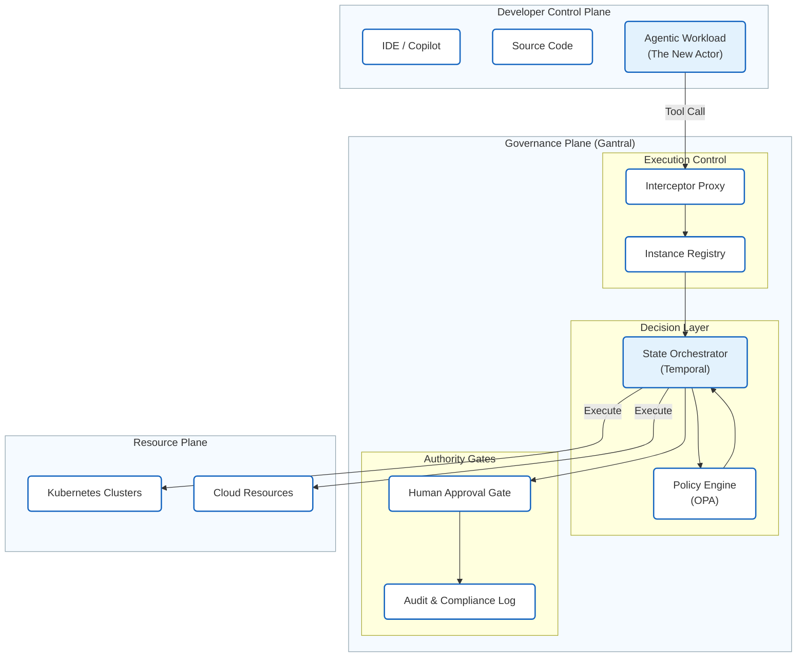

# What Is Gantral?

Gantral is an **open-source AI Execution Control Plane**.

It standardizes how AI-enabled workflows are executed, paused, escalated, approved, overridden, and audited across teams and systems.

Gantral exists to solve a specific problem faced by large organizations:

> **AI adoption breaks execution control and accountability—not just model quality.**

As AI tools spread across the software development lifecycle (SDLC) and operational workflows, organizations lose a consistent way to answer fundamental questions:

- What ran?
- Under whose authority?
- With what configuration?
- What human approved or overrode the outcome?
- Can this decision be replayed and audited?

Gantral provides infrastructure-level mechanisms to record and surface answers to these questions.

---

## The Core Idea: Authority vs. Intelligence

Gantral introduces a **shared execution plane** that separates **Authority** from **Reasoning**.

*   **Agents (CrewAI, LangGraph, etc.)** provide the *Intelligence*. They plan, reason, and generate code.
*   **Gantral** provides the *Authority*. It decides if the agent is allowed to proceed, pauses for human input, and records the outcome.

This separation prevents AI-driven execution from advancing past governed states without explicit authorization.

---

## How It Works (The Runner Pattern)

Gantral does not "host" your agents like a PaaS. It orchestrates them via a **Federated Runner** model (similar to GitHub Actions runners).

1.  **Agents** run in your own infrastructure (Kubernetes, Lambda, etc.).
2.  **Runners** pull tasks from Gantral.
3.  **Gantral** enforces policy barriers (e.g., "High Materiality = Pause").
4.  If a human is required, Gantral suspends the workflow. The agent process can exit (Zero CPU).
5.  On approval, Gantral reschedules the task, and the Runner launches a new agent process to complete the work.

---

## The Enterprise Governance Crisis

Large organizations face two critical failures when scaling AI: **Fragmentation** and **Broken Chain of Custody**.

### 1. Operational Fragmentation
**Gantral prevents 100 different teams from deploying 100 different, unmanaged agent scripts.**

Without a shared control plane, platform teams are overwhelmed by "Shadow Agents":
*   **Siloed Deployments:** Every team reinvents their own "human-in-the-loop" glue code (Slack bots, Jira scripts, manual waits).
*   **Orphaned Processes:** Unmanaged agents run in loops on disparate infrastructure, bypassing standard observability.
*   **Maintenance Nightmare:** Platform engineering cannot enforce global policy changes (e.g., "New Safety Check") because every agent is built differently.

> **"Gantral decouples the Policy of Approval from the Implementation of the Agent, allowing Platform Teams to manage one central control plane instead of debugging 100 different approval scripts."**

### 2. Broken Chain of Custody
Even when humans *are* involved, the handoff between AI and Human is often manual and disconnected.
*   **The "Air Gap":** An agent stops, and a human manually finishes the task. The audit log shows two disconnected events, not one governed workflow.
*   **Invisible Context:** The human approver rarely sees the exact context (prompts, data snapshot) the agent used to make the request.

Gantral acts as the **standardization layer**. It replaces ad-hoc scripts with a unified **Execution Protocol** that binds the Agent's Request to the Human's Decision, ensuring both operational efficiency and auditability.

---

---

## What Gantral Owns

Gantral owns **execution semantics**, not agent memory.

Specifically, Gantral provides:
- A deterministic execution state machine.
- Human-in-the-Loop (HITL) as a blocking state transition.
- Instance-level isolation for audit, cost, and accountability.
- Declarative control policies (Rego-based).
- Immutable execution records with replay capability.

Gantral is intentionally boring, predictable, and auditable.

---

## Mental Models

Gantral can be understood as:

- **"Sudo" for AI** — An agent tries to execute a command, but Gantral intercepts it and asks, "Are you authorized?"
- **Kubernetes for Semantics** — It manages the *lifecycle state* of AI processes, not just the containers.
- **Terraform for Process** — It defines the "Infrastructure of Decision Making" as code.

---

## Next Steps

*   See how the architecture ensures safety in the **[Technical Reference (TRD)](../architecture/trd.md)**.
*   See it in action with the **[Persistent Agent Demo](../guides/demo.md)**.
