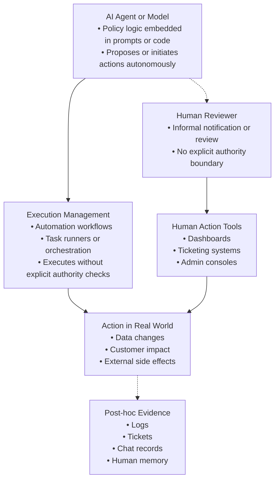
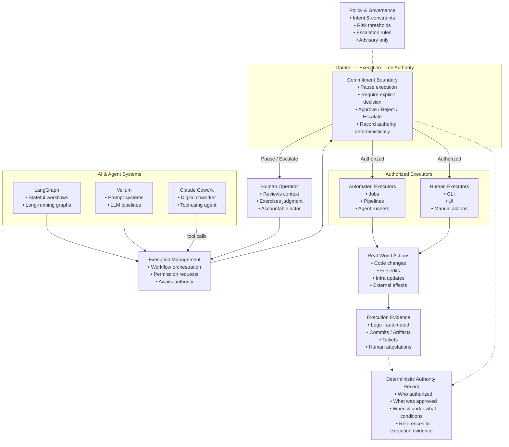

# What Is Gantral?

Gantral is an **open-source AI Execution Control Plane**.

It enforces and records **execution-time authority** in AI-assisted and agentic workflows.

Gantral exists to ensure that when an AI-enabled system performs a consequential action,
an organization can later determine — **without relying on trust or narrative**:

- what executed
- under whose authority
- with which execution context
- whether human approval was required
- whether authority can be independently verified

Gantral does not evaluate model quality, reasoning correctness, or business logic.
It governs **whether execution is allowed to proceed**.

---

## The Problem Gantral Solves

As AI systems move from experimentation into operational workflows,
organizations lose control over **execution authority**, not just model behavior.

Human approval and accountability often exist only as convention:
- pull-request reviews
- chat approvals
- informal runbooks
- screenshots and logs

These mechanisms:
- are not technically enforceable
- are not bound to execution
- do not produce durable, replayable evidence

At scale, this leads to:
- fragmented execution control across teams
- approvals detached from execution context
- post-incident reconstruction based on inference

Gantral exists to make execution authority:

**explicit · enforced · verifiable**

---

## The Execution Authority Gap (Before and After)

Most AI governance failures are not caused by models.
They are caused by how execution authority is implicitly assumed.

The diagrams below contrast the common “before” state
with an execution-time authority model.

**Before:**
In this model, authority is implied by process and reconstructed after the fact.

**After:**

---

## The Core Distinction: Authority vs Intelligence

Gantral introduces a strict separation between **Intelligence** and **Authority**.

- **Agents and AI systems** provide intelligence  
  (planning, reasoning, proposing actions)

- **Gantral** enforces authority  
  (whether execution may proceed, pause, resume, or terminate)

This separation is structural, not conceptual.

Agents may recommend actions.
Policies may advise escalation.
Only Gantral enforces execution authority as state.

---

## How Execution Is Governed

Gantral does not host agents or workflows.
It operates as an **execution-time authority layer**.

A typical flow:

1. An agent proposes an action
2. Execution reaches a governed boundary
3. Gantral evaluates policy as a *guard*
4. Execution either:
   - continues
   - pauses for human authority
   - terminates
5. Authority decisions are enforced via a deterministic state machine
6. A commitment artifact is emitted when authority is exercised

If authority cannot be enforced and recorded,
execution must not proceed.

---

## Federated Execution (Runner Model)

Gantral uses a **federated runner pattern**.

- Agents execute in team-owned infrastructure
- Gantral does not inspect agent memory or tool payloads
- Execution is paused or resumed via explicit authority transitions
- Long waits allow agent processes to exit (zero CPU)
- Resumption launches a new process with fresh context

Gantral governs **execution permission**, not execution mechanics.

---

## The Governance Failure Gantral Addresses

Large organizations encounter two structural failures when scaling AI.

---

### 1. Fragmented Execution Control

Without a shared execution authority layer:

- approval logic is embedded in prompts and scripts
- safety checks are duplicated across teams
- escalation paths are inconsistent
- platform teams cannot reason about enforcement guarantees

Gantral externalizes execution authority from agent logic,
making it deterministic, centrally governed, and auditable.

---

### 2. Broken Chain of Authority

Even when humans are involved, authority is often disconnected from execution.

Common failures:
- approvals based on summaries rather than execution context
- manual execution outside the approval system
- logs that explain *what happened* but not *who authorized it*

Gantral binds:
- execution context references
- authority decisions
- execution state transitions

into a single, immutable execution record.

Gantral does not interpret evidence.
It enforces that **no governed action proceeds without recorded authority**.

---

## What Gantral Owns

Gantral owns **execution authority**, not intelligence.

It provides:
- a deterministic authority state machine
- blocking human-in-the-loop enforcement
- instance-level execution isolation
- policy-as-guard integration (e.g. OPA)
- immutable, replayable authority records

---

## What Gantral Does Not Do

Gantral explicitly does **not**:

- reason or plan
- store or inspect agent memory
- inspect tool payloads
- author business logic
- make autonomous decisions
- guarantee correctness or compliance

Gantral records **authority**, not intent, interpretation, or correctness.

---

## How to Think About Gantral

Useful mental models:

- **“sudo for AI”**  
  Execution is intercepted and requires authority before proceeding.

- **“Control plane for decisions”**  
  Authority is enforced as state, not inferred from logs.

- **“Chain of custody for execution”**  
  Authority is bound to execution at the moment it occurs.

---

## When Gantral Is Appropriate

Gantral is designed for actions that:

- affect production systems
- have regulatory, financial, or security impact
- require explicit human accountability
- must be audited months or years later

Gantral is not necessary for:
- advisory-only agents
- exploratory or sandbox workflows
- low-impact or fully reversible actions

---

## Where to Go Next

- **Authority & Enforcement**  
  See the **[Authority State Machine](../architecture/authority-state-machine.md)**

- **Proof & Audit**  
  Start with **[Verifiability Overview](../verifiability/README.md)**

- **Technical Semantics**  
  Read the **[Technical Reference (TRD)](../architecture/trd.md)**

---

Gantral is intentionally narrow.

It does not try to make AI safe, correct, or ethical.
It makes **execution authority explicit, enforceable, and provable**.
