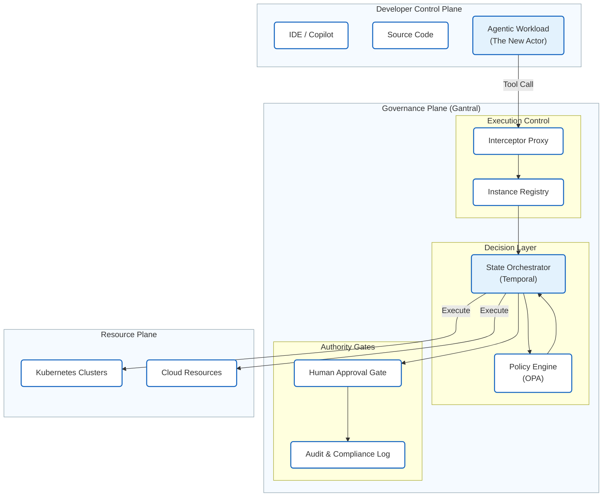

# What Is Gantral?

Gantral is an **open-source AI Execution Control Plane**.

It standardizes how AI-enabled workflows are executed, paused, escalated, approved, overridden, and audited across teams and systems.

Gantral exists to solve a specific problem faced by large organizations:

> **AI adoption breaks execution control and accountability—not just model quality.**

As AI tools spread across the software development lifecycle (SDLC) and operational workflows, organizations lose a consistent way to answer fundamental questions:

- What ran?
- Under whose authority?
- With what configuration?
- What human approved or overrode the outcome?
- Can this decision be replayed and audited?

Gantral provides infrastructure-level mechanisms to record and surface answers to these questions.

---

## The Core Idea: Authority vs. Intelligence

Gantral introduces a **shared execution plane** that separates **Authority** from **Reasoning**.

*   **Agents (CrewAI, LangGraph, etc.)** provide the *Intelligence*. They plan, reason, and generate code.
*   **Gantral** provides the *Authority*. It decides if the agent is allowed to proceed, pauses for human input, and records the outcome.

This separation prevents AI-driven execution from advancing past governed states without explicit authorization.

---

## How It Works (The Runner Pattern)

Gantral does not "host" your agents like a PaaS. It orchestrates them via a **Federated Runner** model (similar to GitHub Actions runners).

1.  **Agents** run in your own infrastructure (Kubernetes, Lambda, etc.).
2.  **Runners** pull tasks from Gantral.
3.  **Gantral** enforces policy barriers (e.g., "High Materiality = Pause").
4.  If a human is required, Gantral suspends the workflow. The agent process can exit (Zero CPU).
5.  On approval, Gantral reschedules the task, and the Runner launches a new agent process to complete the work.

---

## The Enterprise Governance Crisis

Large organizations face two structural failures when scaling AI: **Operational Fragmentation** and **Broken Chain of Custody**.

---

### 1. Operational Fragmentation  
*(The “Shadow Runbook” Problem)*

Gantral prevents critical decision logic from being buried inside agent prompts and scripts.

Without a shared execution control plane, platform teams lose visibility into **why agents act**:

#### Hidden Logic
Business-critical rules (e.g., *“Only restart DB if latency > 5s”*) are embedded in natural-language prompts or agent code, creating **“Shadow Runbooks”** that platform and compliance teams cannot audit, version, or update.

#### Siloed Implementations
Each team reinvents its own safety checks, approval logic, and escalation paths, leading to inconsistent enforcement of organizational policy.

**Gantral decouples decision criteria from agent prompts.**  
It allows platform teams to enforce deterministic, centrally governed policy on top of probabilistic agents, without rewriting agent logic.

---

### 2. Broken Chain of Custody  
*(The “Disconnected Evidence” Problem)*

Even when humans are involved, the link between **facts** and **approvals** is often broken.

#### The Self-Reporting Fallacy
Agents summarize logs, metrics, or tool outputs for humans. These summaries can be incomplete or incorrect. Humans approve actions based on the agent’s narrative, and the audit trail records a “valid” approval for an invalid justification.

#### The Air Gap
An agent recommends an action, and a human executes it manually in a separate system. There is no durable, reviewable link between the execution context at the time of approval and the action taken.

**Gantral acts as the execution anchor layer.**

It binds:

- the execution context references available at the time of decision  
- the human approval or override  
- the enforced execution outcome  

into a single, immutable execution record.

Gantral does not interpret evidence or tool payloads.  
It ensures that **no governed action proceeds without a recorded, attributable human decision tied to the exact execution context that justified it**.

---

## Conceptual Architecture 

---

## What Gantral Owns (and Does Not)

Gantral owns execution semantics, not agent intelligence.

Gantral provides:

- A deterministic execution state machine
- Human-in-the-Loop (HITL) as a blocking state transition
- Instance-level isolation for audit, cost, and accountability
- Declarative control policies (via a pluggable interface)
- Immutable execution records with deterministic replay

Gantral explicitly does not:

- Store or manage agent memory
- Inspect or reason over tool payloads
- Author business logic
- Make autonomous decisions
- Optimize or route models

> Gantral may record references to external execution evidence, but it never inspects, interprets, or governs tool behavior.

Gantral is intentionally boring, predictable, and auditable.

---

## Mental Models

Gantral can be understood as:

- **"Sudo" for AI** — An agent tries to execute a command, but Gantral intercepts it and asks, "Are you authorized?"
- **Kubernetes for Semantics** — It manages the *lifecycle state* of AI processes, not just the containers.
- **Terraform for Process** — It defines the "Infrastructure of Decision Making" as code.

---

## When Gantral Is (and Is Not) the Right Tool

Gantral is appropriate when actions:

- Affect production systems
- Have regulatory, financial, or security impact
- Require explicit human accountability
- Must be auditable months or years later

Gantral is not required for:

- Purely advisory agents
- Sandbox or exploratory workflows
- Fully reversible or non-material actions

---

## Next Steps

*   See how the architecture ensures safety in the **[Technical Reference (TRD)](../architecture/trd.md)**.
*   See it in action with the **[Persistent Agent Demo](../guides/demo.md)**.
