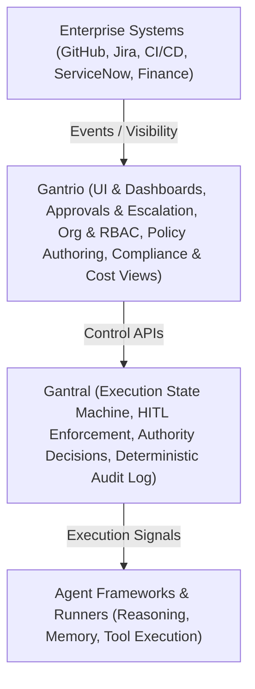

**Version:** v5.0 (Authority–Experience Split Clarified)  
**Status:** Public, canonical product document  
**Audience:** Enterprises, platform engineers, contributors, regulators, partners  

---

## 1. Purpose of This Document

This document defines the **public product boundaries, responsibilities, and intent** of:

- **Gantral** — the open-core AI Execution Control Plane  
- **Gantrio** — the commercial enterprise control experience built on top of Gantral  

It exists to:

- Prevent category confusion (e.g. “agent platform”, “workflow engine”)
- Make the **Gantral vs Gantrio split unambiguous** to outsiders
- Serve as a guardrail against scope creep
- Provide a regulator-aware, non-hype explanation of how AI is governed at execution time

If an implementation or product claim contradicts this document, it is incorrect.

---

## 2. The Core Problem (Non-Negotiable)

Large organizations are adopting AI across SDLC, operations, finance, compliance, support, and internal workflows.

What breaks is **not model capability**.

What breaks is:

- Execution control  
- Human authority  
- Accountability  
- Auditability at organizational scale  

### What Happens in Practice

- AI usage is fragmented and team-driven  
- Human review exists, but only as behavior (Slack, email, checklists)  
- Approvals are informal, inconsistent, and non-auditable  
- No system of record exists for *who allowed what to run, and why*

Organizations do not lack AI tools.  
They lack an **AI execution control plane**.

---

## 3. The Mental Model

The system is composed of **two strictly separated layers**:

- **Gantral** decides **whether execution may proceed**
- **Gantrio** helps humans **see, manage, and operate those decisions**

> **Gantral decides. Gantrio shows and manages.**

This separation is **structural, not cosmetic**.

---

## 4. What Gantral Is (Open Core)

**Gantral is an AI Execution Control Plane.**

It is infrastructure that standardizes how AI-assisted and agentic workflows:

- Start  
- Pause for human authority  
- Resume, override, or terminate  
- Produce deterministic, auditable records  

Gantral sits **above agent frameworks** and **below enterprise systems**.

### Gantral Owns

- Canonical execution state machine  
- Immutable execution instances  
- Human-in-the-Loop (HITL) as a first-class execution state  
- Authority transitions (approve / reject / override)  
- Policy evaluation **interfaces** (not policy UX)  
- Deterministic execution history and replay  
- Control APIs and SDKs  

### Gantral Explicitly Does NOT Own

- User interfaces  
- Org or team modeling  
- RBAC UX  
- Policy authoring tools  
- Workflow builders or editors  
- Approval inboxes or notifications  
- Cost dashboards or optimization logic  
- Integrations UX  

Gantral **enforces authority**.  
It does not explain, visualize, or manage it for humans.

---

## 5. What Gantrio Is (Commercial Platform)

**Gantrio is the enterprise control experience for Gantral.**

Gantrio exists because real organizations cannot operate execution authority via APIs and logs alone.

Gantrio turns Gantral’s authoritative records into:

- Human-operable workflows  
- Enterprise-grade visibility  
- Compliance-ready artifacts  

### Gantrio Owns

- Enterprise UI  
- Human approval inboxes and escalation views  
- Org, team, and role modeling  
- RBAC and delegation  
- Policy authoring and lifecycle UX  
- Compliance reporting and exports  
- Cost attribution and usage visibility  
- Integrations (Jira, GitHub, ServiceNow, Slack, etc.)  
- Managed hosting and enterprise support  

Gantrio **never enforces execution authority**.

If Gantrio is unavailable, Gantral must still behave correctly.

---

## 6. Gantral vs Gantrio — Feature Boundary Table

| Capability | Gantral (Open Core) | Gantrio (Commercial) |
|---------|------------------|-------------------|
| Execution state machine | ✅ | ❌ |
| HITL enforcement | ✅ | ❌ |
| Authority transitions | ✅ | ❌ |
| Deterministic replay | ✅ | ❌ |
| Policy evaluation interface | ✅ | ❌ |
| Policy authoring UX | ❌ | ✅ |
| Approval inboxes | ❌ | ✅ |
| Org / team modeling | ❌ | ✅ |
| RBAC & delegation | ❌ | ✅ |
| Compliance reports | ❌ | ✅ |
| Cost dashboards | ❌ | ✅ |
| Integrations UI | ❌ | ✅ |
| Managed hosting | ❌ | ✅ |

This boundary is **intentional and enforced**.

---

## 7. What Lives Where — Responsibility Diagram

Gantral is the **authority layer**.
Gantrio is the **enterprise experience layer**.

---

## 8. What Gantral Will Explicitly Never Become

To avoid confusion and trust erosion, Gantral will never:

* Build or host agents
* Provide workflow builders
* Optimize or route models
* Make autonomous decisions
* Store agent memory or prompts
* Act as an identity provider

These are **structural non-goals**.

---

## 9. What Changes After Adoption

**Before:**

* AI approvals happen outside execution
* Governance relies on discipline
* Audit is reconstructed manually

**After:**

* Execution pauses for required human authority
* Decisions are enforced technically
* Audit trails are native and deterministic

Governance becomes a **by-product of normal execution**.

---

## 10. Final Reminder

Gantral is not about what AI *can* do.

It is about what organizations are willing to **allow AI to do — and how they prove it**.

Gantrio exists to make that control usable at enterprise scale.

